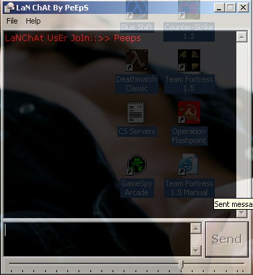



## Lan Chat v2\.0

### Description

Vote PEEPS, he needs the support!

LanChat now supports commands and will allow commands to be typed in masked text box to stop others from seeing these commands. The form also flashes quite nicely now.

Want to have a very simple chat system that starts up with the PC? This is the code for you!

Lan Chat starts when the PC does using the regisrty and can send messages to any other users that are running Lan Chat. There are no servers required, it is completely UDP based. It also uses a translucent form so if, like me, you are currently a student wanting to share information without getting screwed by your lecturer/teacher, you can semi hide the window, so from a distance you are still in Word typing that essay ;)

An extensive ReadMe is included in the zip along with the Win Sock control for those who do not have it. Also, the code is commented where appropiate.

Hope you like the screenshot as well, in particular the background! Oooh, such smut! tee hee hee. ;)

This will only work on Win 2K and XP (not sure about NT4). Vote for Moi if this helps you, I need the support as a poor student. Thanks and enjoy!
 
### More Info
 

             |
---                |---
**Submitted On**   |2002-03-12 17:48:10
**By**             |[Sam North](https://github.com/Planet-Source-Code/PSCIndex/blob/master/ByAuthor/sam-north.md)
**Level**          |Intermediate
**User Rating**    |4.8 (24 globes from 5 users)
**Compatibility**  |VB 5\.0, VB 6\.0
**Category**       |[Complete Applications](https://github.com/Planet-Source-Code/PSCIndex/blob/master/ByCategory/complete-applications__1-27.md)
**World**          |[Visual Basic](https://github.com/Planet-Source-Code/PSCIndex/blob/master/ByWorld/visual-basic.md)
**Archive File**   |[Lan\_Chat\_v616123122002\.zip](https://github.com/Planet-Source-Code/sam-north-lan-chat-v2-0__1-32035/archive/master.zip)

